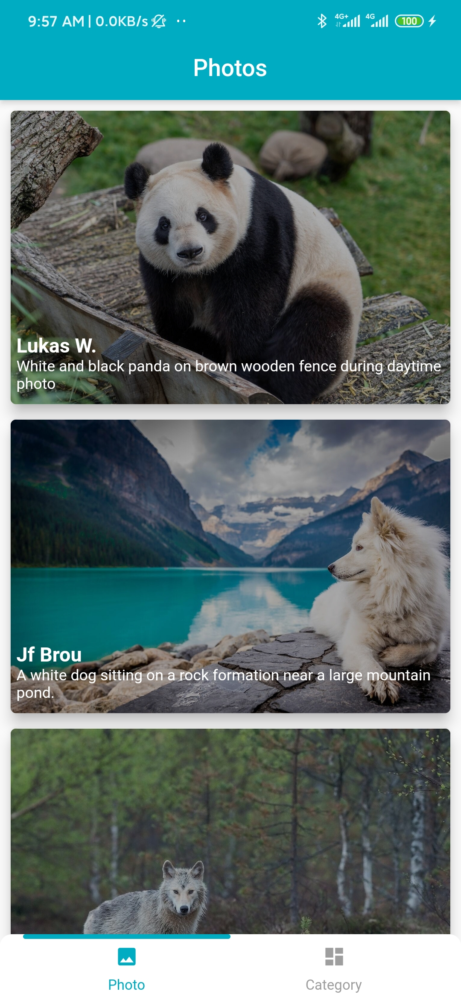
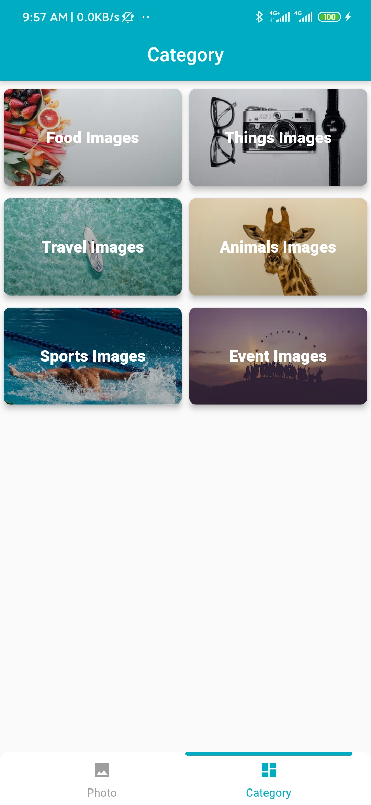
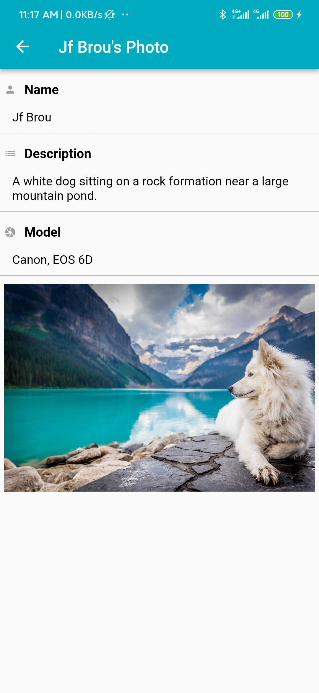
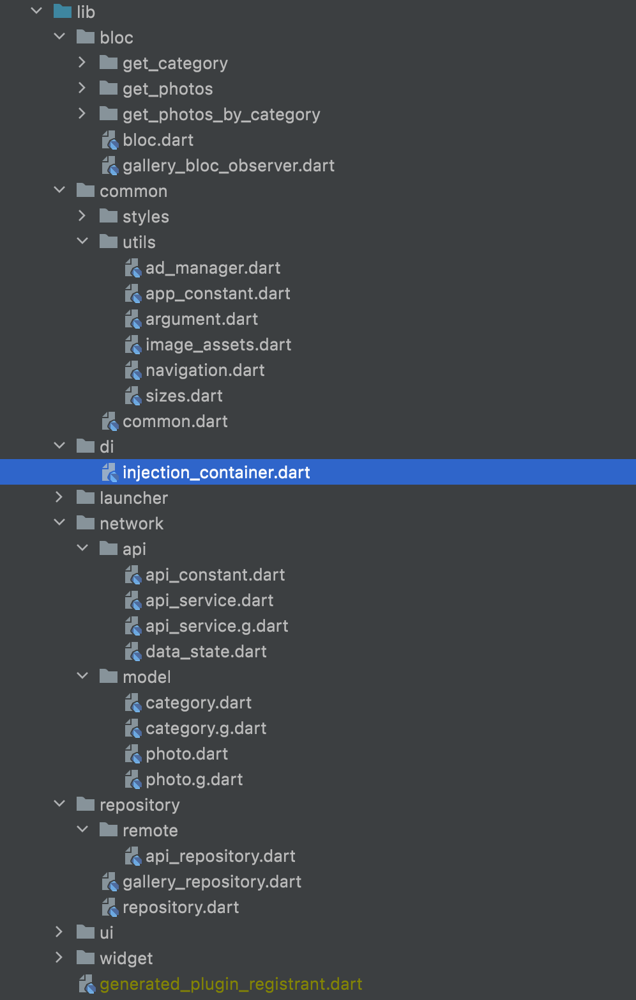
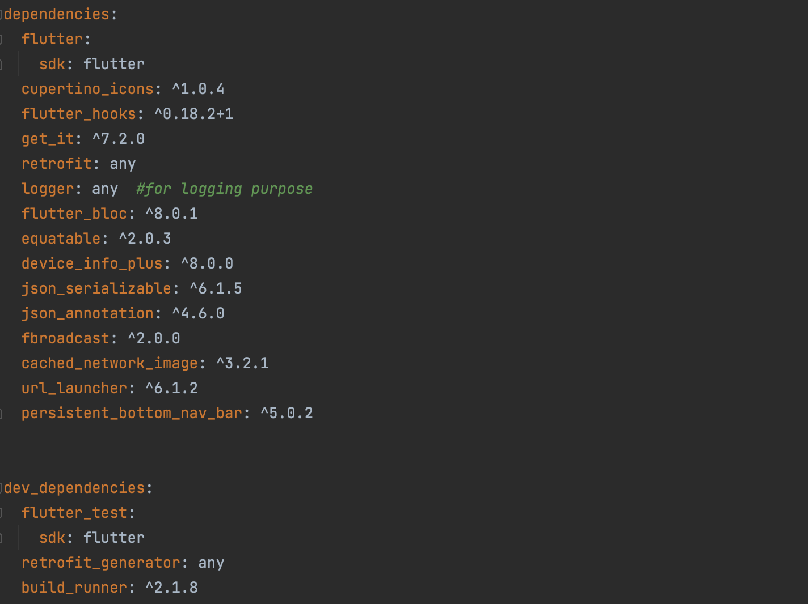

Gallery Flutter
===============
I just want to show clean architecture and project structure for flutter.

Screenshot
==========
Photo            |  Category			|  Detail
:-------------------------:|:-------------------------:|:-------------------------:
  |   |   

Backend Api
===========
I created admin portal and api to implement this project with **Laravel language**

You can check in [https://github.com/naylinndev/Gallery-Backend.git](https://github.com/naylinndev/Gallery-Backend.git).

**If you wanna try demo, you can check in [https://gallery.ntoon.app/](https://gallery.ntoon.app/)**

User Name - **naylinndev@gmail.com**

Password - **Admin**

Author
======
Nay Lin - @naylinndev on GitHub

Folder Structure
================
Folder Structure            |  Library
:-------------------------:|:-------------------------:
   |  

